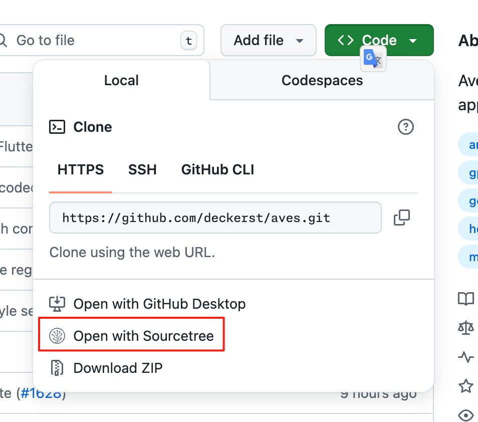

# Tampermonkey Scripts

A collection of personal Tampermonkey scripts to enhance web browsing.

---

## Scripts

### GitHub Clone with Sourcetree

This script adds an "Open with Sourcetree" button to the GitHub "Code" dropdown menu, allowing you to clone repositories directly into the Sourcetree application.

#### Features:
- Adds a convenient button to the clone dialog.
- Uses the official Sourcetree app icon, which adapts to GitHub's light and dark themes.
- Automatically detects the repository's HTTPS clone URL.

### Installation

1.  Make sure you have a user script manager installed, such as [Tampermonkey](https://www.tampermonkey.net/) or [Greasemonkey](https://www.greasespot.net/).
2.  Navigate to the script file in this repository: [`github-clone-sourcetree.user.js`](https://github.com/cooaer/Tampermonkey-scripts/raw/master/github-clone-sourcetree.user.js).
3.  Click the link, and your user script manager will automatically open and prompt you to install the script.

### Usage

1.  Go to any GitHub repository page.
2.  Click the green "Code" button.
3.  You will see the new "Open with Sourcetree" button in the dropdown list.
4.  Clicking it will launch the Sourcetree application and open the clone dialog for that repository.
